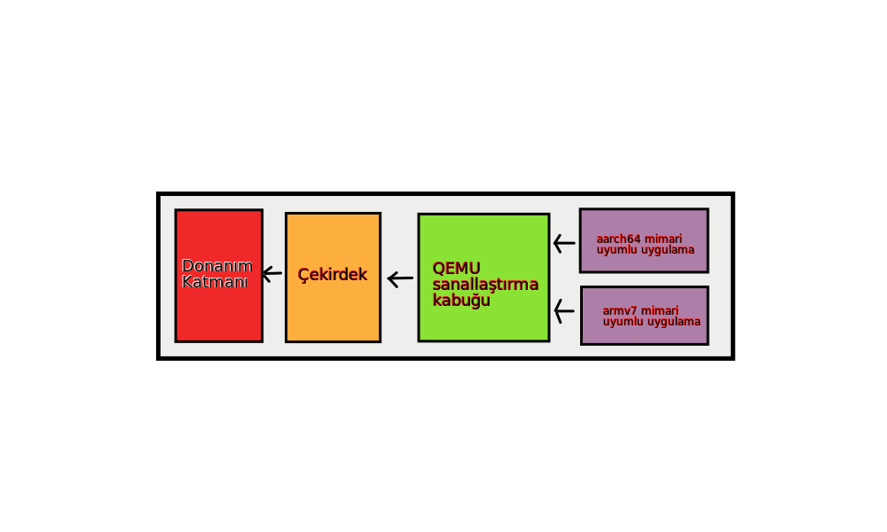
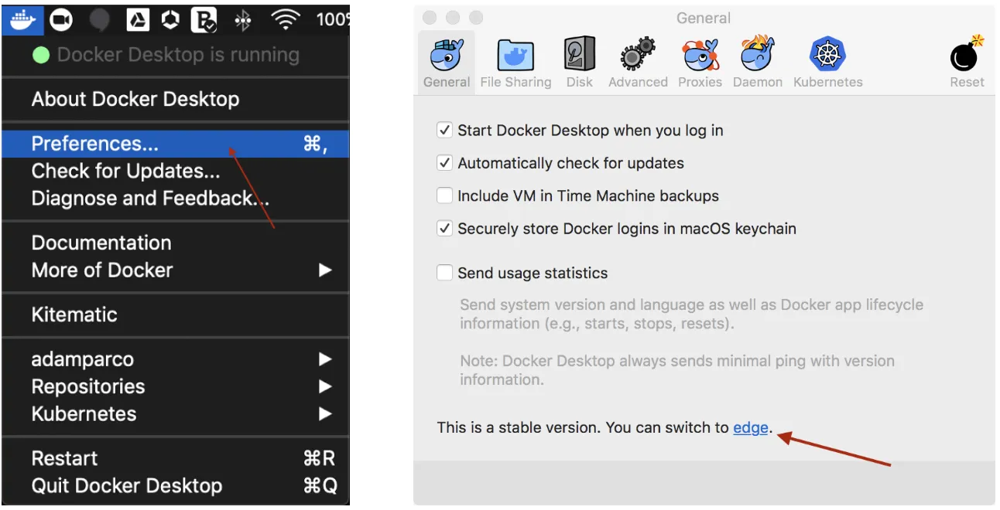

# Çoklumimari Docker İmajı yaratma

Docker ve konteyner mantığı ile gelen mikroservisler dünyayı şu an kasıp kavurmakta. Ancak, yükselişte olan RICV bazlı işlemciler sebebi ile docker imajları oluştururken birden fazla mimariye uygun bir şeyler yapmak, en azından sürdürülebilirliği sağlamak için oldukça önemli.
 
Burda x86_64 mimarisi üzerinde ARM Docker imajı oluşturmayı anlatacağım.

## Temel mantık

Docker, sistemin çekirdeğini kullanarak sistemden izole olarak konteyner çalıştırmayı sağlar. Bu sebeple çalışan konteyner sistem direk çekirdek ve mimari ile bağlantılı olarak çalışır. Docker, farklı bir mimariye ait ikili dosyaları ve sistem konteynerlerini çalıştırmak için araya qemu ortamını koyarak, konteyneri sanallaştırır.

Docker'in bu yapısı; özellikle nvidia jetson, raspberry pi, orange pi gibi düşük güçlü cihazlarda kullanılmalık docker imajları oluşturmayı veya onlarda çalışan imajları kontrol etmeyi sağlar, zaten hantal çalışan düşük güçlü donanımları daha efektif kullanmamızı sağlar.

## Kurulum

Docker'in bu özelliği `stable` docker paketleri ile gelmemekte. Burada Windows ve Mac işletim sistemleri için çözüm Docker Desktop'un ayarlarını değiştirerek `stable` kanaldan `edge` kanalına geçmektir.

bu ayarı yapmak otomatik olarak çoklumimari kullanımı için docker'i uygun hale getirecektir.

Linux'ta ise biraz kabakuvvet kullanmamız lazım. 
Başta sistemi hazırlayalım. Sisteme qemu kurmamız gerekmekte


$ sudo apt-get update
$ sudo apt-get install qemu binfmt-support qemu-user-static 


İsteğe bağlı olarak docker'in edge kanalına geçebilirsiniz. Ancak stable kanalda da bu çalışacaktır. Ardından yapmamız gereken ise register betiklerini çalıştırmak.


$ docker run --rm --privileged multiarch/qemu-user-static --reset -p yes


## Farklı Mimarilere Ait İmajları Çalıştırmak

Herhangi bir başka mimariye ait imajı getirelim. Ben aarch64 için oluşturulmuş ubuntu imajını getirelim.


$ docker pull aarch64/ubuntu:latest
$ docker run --privileged --runtime aarch64_ubuntu --rm aarch64/ubuntu:latest


Eğer ki çalışırsa sorun yok demektir.

## Çoklumimari İmajlar Oluşturmak

`buildx` eklentisi sayesinde başka bir mimari için docker imajları inşaa edebiliriz. `buildx` eklentisini docker içerisine elle de ekleyebilir.

Başta [docker buildx reposundan](https://github.com/docker/buildx/releases) sisteminiz için uygun ikili dosyayı indirin. Sonrasında bu dosyayı `~/.docker/cli-plugins/docker-buildx` konumuna atın ve çalıştırılabilir yetkisi verin.


$ wget https://github.com/docker/buildx/releases/download/v0.5.1/buildx-v0.5.1.linux-amd64
$ mkdir .docker/cli-plugins/ -p
$ mv buildx-v0.5.1.linux-amd64 .docker/cli-plugins/docker-buildx
$ sudo chmod +x ~/.docker/cli-plugins/docker-buildx


Ardından `docker buildx` komutunu çalıştırırsanız, docker içerisine bu komutun eklendiğini göreceğiz


$ docker buildx
Usage:  docker buildx [OPTIONS] COMMAND

Build with BuildKit

Options:
      --builder string   Override the configured builder instance

Management Commands:
  imagetools  Commands to work on images in registry

Commands:
  bake        Build from a file
  build       Start a build
  create      Create a new builder instance
  du          Disk usage
  inspect     Inspect current builder instance
  ls          List builder instances
  prune       Remove build cache 
  rm          Remove a builder instance
  stop        Stop builder instance
  use         Set the current builder instance
  version     Show buildx version information 

Run 'docker buildx COMMAND --help' for more information on a command.


Şimdi `builder`'ları kontrol edelim.


$ docker buildx ls
NAME/NODE DRIVER/ENDPOINT STATUS  PLATFORMS
default * docker
  default default         running linux/amd64, linux/arm64, linux/arm/v7, linux/arm/v6


Sadece default builderimiz var ve x86_64, arm64, arm/v7 ve arm/v6  mimarileri için çalışan bir `default`,  builderimiz var.

Yeni bir builder oluşturalım.


$ docker buildx create --name mybuilder
mybuilder
$ docker buildx use mybuilder
$ docker buildx inspect --bootstrap
[+] Building 2.5s (1/1) FINISHED
 => [internal] booting buildkit                                                   6.5s
 => => pulling image moby/buildkit:master                                         2.1s
 => => creating container buildx_buildkit_mybuilder0                              1.9s
Name:   mybuilder
Driver: docker-container

Nodes:
Name:      mybuilder0
Endpoint:  unix:///var/run/docker.sock
Status:    running

Platforms: linux/amd64, linux/arm64, linux/arm/v7, linux/arm/v6



Biraz önceki oluşturduğumuz ubuntu imajını kullanarak farklı mimariler için imajlar oluşturabiliriz. Bunun için `Dockerfile` oluşturalım.


$ cat << EOF > Dockerfile
FROM ubuntu
RUN apt-get update && apt-get install -y curl
WORKDIR /src
COPY . .
EOF


`buildx` ile bunu inşaa edelim.


$ docker buildx build --platform linux/amd64,linux/arm64,linux/arm/v7 -t zaryob/ubuntu:latest .


Eğer isterseniz bu inşaa ettiğiniz imajı inşaa eder etmez docker.io hesabınıza gönderebilirsiniz bunun için yukardaki komut fazladan bir `--push` parametresi alır.


$ docker buildx build --platform linux/amd64,linux/arm64,linux/arm/v7 -t zaryob/ubuntu:latest . --push


komutun bitmesine mutakiben imajları kontrol edelim.


$ docker buildx imagetools inspect zaryob/ubuntu:latest
Name:      docker.io/zaryob/ubuntu:latest
MediaType: application/vnd.docker.distribution.manifest.list.v2+json
Digest:    sha256:92d376e3512986d8ba947b3e7f20b59763ca149b0fd286d5f2b4ad12fbffb31b

Manifests:
  Name:      docker.io/zaryob/demo:latest@sha256:4bc72d9e524a659f4c3e106ff3e2b250db065e6be52b379f122f607aa47fa5d1
  MediaType: application/vnd.docker.distribution.manifest.v2+json
  Platform:  linux/amd64

  Name:      docker.io/zaryob/demo:latest@sha256:660bb70d9196d8c0e2e780c3ea208889f7d2fb8243bc1459a61d4b55dc268e2e
  MediaType: application/vnd.docker.distribution.manifest.v2+json
  Platform:  linux/arm64

  Name:      docker.io/zaryob/demo:latest@sha256:fdbbeb649b5ea65830c5ee29ab28d422d58ef027f758296652aeff7052f90adf
  MediaType: application/vnd.docker.distribution.manifest.v2+json
  Platform:  linux/arm/v7



arm64 imajının çalışırlığını kontrol edelim 

$ docker run --rm docker.io/zaryob/ubuntu:latest@sha256:660bb70d9196d8c0e2e780c3ea208889f7d2fb8243bc1459a61d4b55dc268e2e uname -m
aarch64


örnekte olduğu gibi komutun çıktısı eğer aarch64 olarak veriliyorsa sorun yok demektir. Güle güle kullanın.